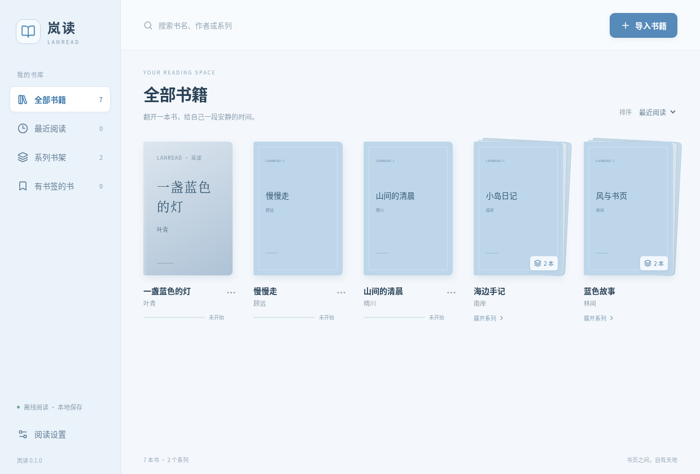

# 岚读 · LanRead

面向 **Windows 10 / 11（64 位）** 的本地 EPUB 阅读器。淡蓝色界面，无需账户，阅读时无需联网。



[阅读界面与验证记录](docs/VALIDATION.md)

## 普通用户下载与运行

在 [GitHub Releases](https://github.com/JerryZhang-qaq/testing/releases/latest) 下载 Windows 成品，不需要下载源码或安装 Node.js。

- **安装版**：下载 `LanRead-0.2.0-Windows-x64-Setup.exe`，双击并按向导安装。安装器自动检查 64 位 Windows 10 / 11，并说明完整运行环境已内置。
- **ZIP 免安装版**：下载 `LanRead-0.2.0-Windows-x64.zip` → 全部解压 → 双击 `岚读.exe`。保留整个解压目录，不能只复制 EXE。

两种版本都可离线阅读，都使用 Electron 的本机应用数据目录保存书库和备注；免安装不等于自动将书库放在程序目录。安装器不修改系统 Node.js 或 PATH。GitHub 页面里的 `Source code (zip)` 是开发源码。

`SHA256SUMS.txt` 提供成品下载的校验值。EXE 尚未签名，会显示未知发布者。

## 已实现

- 批量导入 EPUB，自动读取封面、作者、书名；没有封面时生成文字封面。
- 自动识别 Calibre / EPUB 3 系列信息；可以手动编辑系列名称及册序，支持小数册序。同系列以堆叠书籍显示，点击展开。
- 按书名、作者和系列搜索，按名称、导入时间或最近阅读排序。
- EPUB 2（NCX）和 EPUB 3（导航文档）目录、章节跳转、分页阅读、方向键翻页。
- 保存阅读位置及百分比；字体或窗口变化后使用 EPUB CFI 恢复内容位置。
- 每根书签保存独立标题和备注；支持自动保存、跳转、编辑和删除。同一位置可以添加多根书签。
- 原字体 / 宋体 / 微软雅黑 / 楷体，字号和行距调整，冰蓝 / 纯白 / 夜读配色及自定义背景、文字颜色。
- 120–160 ms 的界面过渡，遵循系统“减少动画”设置。

## 在 Windows 运行源码

安装 [Node.js 24 LTS](https://nodejs.org/)，下载本仓库并解压。在项目目录打开 PowerShell：

```powershell
npm ci
npm run dev
```

`npm ci` 会根据锁文件安装依赖并下载 Electron。首次安装需要访问 npm 和 GitHub 的 Electron 发布资源；实际阅读不需要联网。Electron 44 使用显式安装命令，项目的 `postinstall` 已处理。

或者运行构建后的桌面应用：

```powershell
npm run build
npm start
```

无需 Python、Docker 或单独的数据库。不要用浏览器直接打开 `index.html`，书库访问由桌面应用提供。

## 生成 Windows 安装包

在 **Windows 64 位机器** 上运行：

```powershell
npm ci
npm test
npm run test:e2e
npm run dist:win
```

成品输出到 `release/LanRead-0.2.0-Windows-x64-Setup.exe` 和 `release/LanRead-0.2.0-Windows-x64.zip`，支持选择安装目录和创建桌面快捷方式。两种成品均不需要用户安装 Node.js。

仓库包含 `.github/workflows/windows.yml`：普通提交在 Windows 测试并构建成品；推送匹配 `package.json` 版本的 `v*` 标签后，工作流在验证源码、ZIP 中的实际应用及 EXE 安装后的实际应用均通过后，自动发布到 GitHub Releases，并附带 SHA-256 校验文件。无需手工提供 GitHub Token，发布任务使用 GitHub Actions 自带、仅对本仓库有效的令牌。当前没有配置代码签名，Windows 可能显示未知发布者提示；正式签名发行应配置有效的 Windows 签名证书。

## 使用

1. 点击“导入书籍”，可以选择多个 `.epub` 文件。
2. 同系列自动堆叠；展开系列后，点击单本书右下角菜单 → “编辑系列”可修改分组及册序。清空系列名称恢复为单本。
3. 点击封面开始阅读；左侧“目录”跳到章节，左右方向键或底部按钮翻页。
4. 点击正文右上角书签图标，为当前位置添加书签。“书签”面板中选中一根书签，编辑其标题和独立备注，看到“已保存”即完成持久化。
5. 点击“外观”调整字体、字号、行距和配色。设置应用于所有书籍。

### 系列整理

点击「新建系列」创建书架，将单本书拖到系列卡片即可加入。展开系列后，默认按册序排序：手动填写或 EPUB 元数据中的册序优先；没有册序时，尝试识别书名、导入文件名中的「第十二卷」「Vol. 02」「Book 3」等编号，再按自然名称排序。册序 0 表示自动识别，无法判断的书可手动编辑。

在系列内将「系列排序」切换为「手动拖拽」，拖动卡片到另一张卡片左半边／右半边，分别插入到它的前面／后面；也可用左右箭头移动。顺序会保存，之后加入的书放在末尾。切回「自动册序」即可恢复自动排序。搜索时暂停拖拽，清除搜索后即可继续。

没有声明封面的 EPUB，会优先按章节阅读顺序提取第一张可用图片，再尝试清单图片；无图片时使用生成封面。更新后已有书库中的无封面书也会尝试补全。

### 保留数据升级

新版 EXE 安装向导提供「更新已有岚读」。自动识别安装版旧目录，也允许浏览选择旧版目录（必须包含 `岚读.exe` 和 `resources/app.asar`），ZIP 版可以选择原解压目录。先关闭阅读器，再进行升级。

程序安装目录与用户数据目录分开。升级只替换程序，同一 Windows 用户原有的 EPUB 副本、系列、阅读进度、书签备注与阅读设置会继续使用，不需要重新导入。不要手动删除数据目录。通过 `LANREAD_DATA_DIR` 自定义路径的用户，升级后需继续使用原环境变量。

### 本地数据与备份

书籍导入后复制到应用数据目录，移动原始文件不影响阅读。移出书库会删除应用副本、进度和书签，不会删除原始文件。

Windows 默认数据目录通常是 `%APPDATA%/lanread`。以应用“阅读设置”内显示的实际目录为准：

```text
应用数据目录/
  library.json       # 书籍信息、系列、CFI 位置、独立书签、阅读设置
  books/
    <SHA256>.epub    # 导入的书籍副本
```

关闭应用后备份整个目录即可；恢复时也先关闭应用，再还原完整目录。书签不会写回原始 EPUB。重新导入同一本书按文件内容去重；不同版本视为不同书籍。

### 兼容范围

主要支持未加密的可重排 EPUB 2/3，包括中文正文、图片、外部样式表、NCX / 导航目录。自动检查损坏 ZIP、异常资源路径和超大压缩内容，单本最大 150 MB。

- 不支持 DRM 加密内容，不绕过授权。
- 固定版式、竖排、复杂公式、音视频和字体混淆书籍尚未逐类验证。字体混淆允许导入；字体显示有问题时可改用本机字体。
- 不执行书籍脚本，不加载网络资源，不打开外部链接；需要网络资源或脚本的交互式 EPUB 无法完整呈现。
- 不支持 PDF、MOBI、AZW、TXT，不包含标注选中文字、全文搜索或云同步。

## 开发与测试

```text
electron/       Electron 主进程、安全的 preload API、书库及 EPUB 元数据解析
src/            React + TypeScript 界面、阅读器与样式
tests/          数据层测试、实际 Electron 界面测试、原创生成 EPUB 测试样本
scripts/        开发服务器启动
```

```powershell
npm test          # 数据层测试
npm run build     # TypeScript 检查和生产构建
npm run test:e2e  # 实际 Electron 界面测试，包含 EPUB 2/3 阅读与重启持久化
```

Linux 测试需要 GTK/NSS 等 Electron 系统依赖、中文字体和显示服务（例如 Xvfb）。受限容器不能启用 Chromium 系统沙盒时，**仅测试**可设置 `LANREAD_TEST_NO_SANDBOX=1`。应用的生产启动配置保持沙盒、上下文隔离及关闭 Node 集成，不包含此测试参数。

可设置 `LANREAD_DATA_DIR` 指向独立数据目录，方便测试而不影响自己的书库。

## 技术和开源许可

Electron、React、TypeScript、EPUB.js、JSZip、fast-xml-parser、Lucide、Vite、electron-builder。版本由 `package-lock.json` 固定；EPUB.js 的 XML 依赖覆盖为修复已知问题的 `@xmldom/xmldom@0.8.15`。

应用代码使用 MIT 许可；第三方依赖继续遵循各自许可。详见 [THIRD_PARTY_NOTICES.md](THIRD_PARTY_NOTICES.md)。

### 验证状态

Windows 工作流已验证源码、ZIP 解压后的实际程序及 EXE 安装后的实际程序，均通过 EPUB 阅读、系列书库、独立书签、阅读外观和重启恢复测试。具体结果见 [验证记录](docs/VALIDATION.md)。不同出版商的全部 EPUB、所有 Windows 版本及硬件配置尚未逐一验证。
