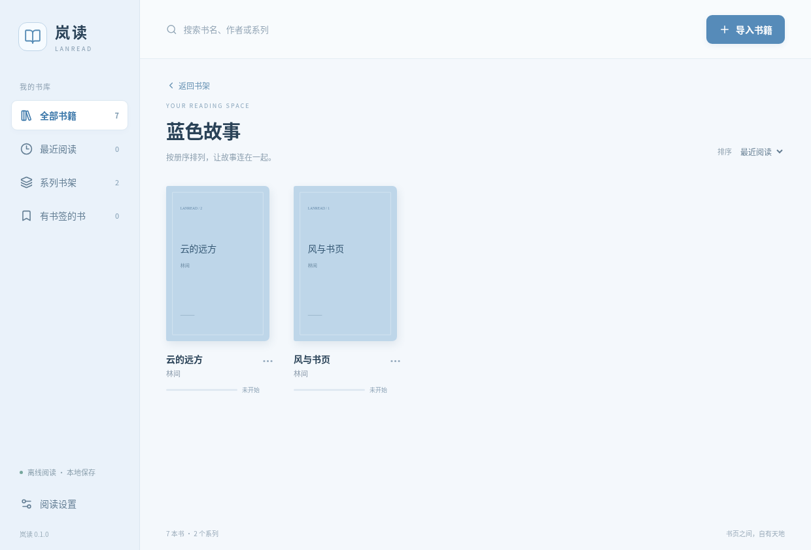
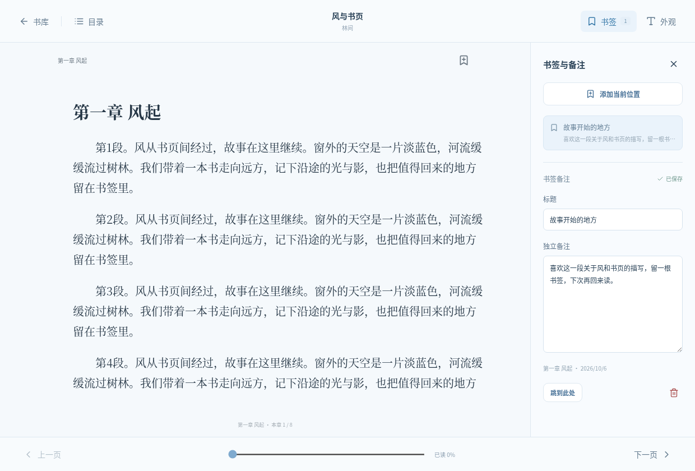

# 第一版验证记录

在云端 Linux、Node.js 24.19.0、Electron 44.5.1 下验证；另外通过 GitHub Actions 的实际 Windows runner 验证了源码和两种成品。Linux 界面测试使用虚拟显示，受限容器中仅测试启用 `LANREAD_TEST_NO_SANDBOX=1`。Windows 使用默认沙盒配置。

| 检查 | 结果 |
| --- | --- |
| 冻结锁文件安装 `npm ci`，包含 Electron 安装与官方 checksum 校验 | 通过 |
| `npm run build`（TypeScript、Vite、第三方许可清单） | 通过 |
| `npm test` | 14 通过，0 失败、跳过或取消 |
| `npm run test:e2e` | 原始 3 项通过；新增慢速磁盘书签切换回归测试通过 |
| `npm audit --omit=dev` | 0 已知运行时依赖漏洞 |
| 全依赖 `npm audit` | 8 个中等等级报告，来自打包工具链的 `sprintf-js` 及其依赖链；未使用强制降级修复 |
| Windows 数据层测试 | 14 项通过 |
| Windows 源码桌面测试 | 4 项通过 |
| Windows ZIP 构建、解压、实际程序测试 | 构建和解压通过，4 项实际程序测试通过 |
| Windows EXE 安装包构建、静默安装、安装后程序测试 | 构建和安装通过，4 项实际程序测试通过 |
| 发布文件完整性 | 自动生成 SHA-256；发布任务下载后再次校验 |

Windows 验证对应应用代码提交 `3b60bde`，运行记录：[Windows build and release #5](https://github.com/JerryZhang-qaq/testing/actions/runs/37510708907)。后续发布标签工作流会重新构建并验证对应标签的成品，再公开发布。

实际 Windows 安装后测试发现“新增书签等待期间仍可编辑旧书签”的时序问题，现已修复：新增期间暂时禁用旧编辑框，完成后切换到新书签。新增回归测试通过模拟慢速磁盘写入，确认旧书签标题和备注不会被误改。已在源码、ZIP 和安装后的程序上验证。

桌面测试实际执行：

- 导入 EPUB 2/3，显示封面、作者，按系列堆叠并按册序展开。
- 加载实际 XHTML 正文及样式，上一页 / 下一页、EPUB 3 目录和 EPUB 2 NCX 目录跳转。
- 同一位置创建两根书签，分别编辑标题和备注，验证互不覆盖。
- 切换夜读背景和字体字号，验证正文实际计算样式。
- 关闭 Electron 并重新启动，恢复章节位置、字体设置和独立书签备注，再删除单根书签。
- 手动编辑系列、作者搜索、损坏文件与有效文件混合导入、重复导入去重、移出书库且保留原文件。
- 嵌入书籍的脚本不执行，远程图片不能加载。

测试 EPUB 为代码生成的原创样本，并非各种出版商的完整兼容性语料库。固定版式、竖排、复杂公式、字体混淆和媒体 EPUB 尚未逐类验证，不宣称兼容所有 EPUB。

## 界面截图

截图来自真实运行的应用，书籍为自动生成的原创演示样本，不包含用户数据，应用不会预装这些样本。

